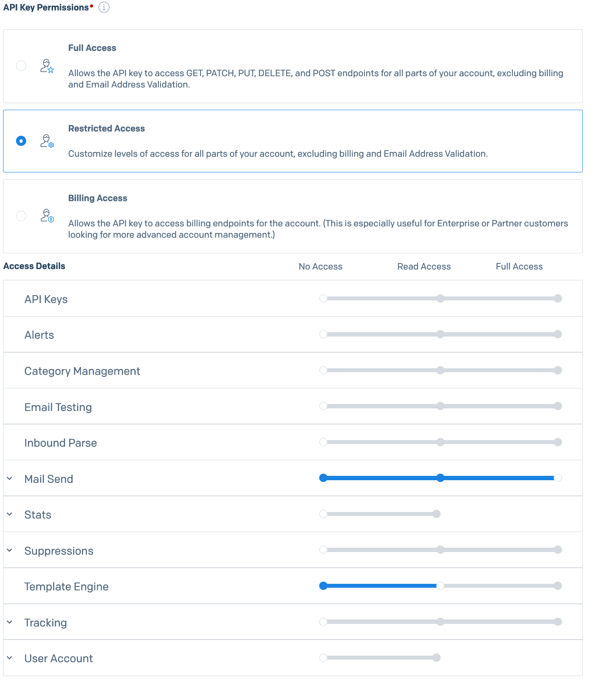

# Bulk Email 

## Description 
This repository is a web app version of the terminal solution that we were using previously [https://github.com/EqualsGroup/bulk-email](https://github.com/EqualsGroup/bulk-email). 


### Environment and Tools
- Node (lts recommended)
- [Express](https://expressjs.com/)
- [Sendgrid APIs](https://sendgrid.com/docs/api-reference/)
- Jade View Engine
- [NPM](https://www.npmjs.com/)

Currently working on a branch to change the Jade view engine to [express-handlebars](https://github.com/ericf/express-handlebars)

## Development Guide
 
### Install dependencies 

The package manager used in this project is npm. 

To install all the dependencies in the `package.json` file, run the following command in your terminal inside this directory:

```bash
npm install
```

### Environment variables

Copy the content of `.env.example` into a new file called `.env` by running the following in your terminal:

```bash
cp .env.example .env
```

### Sendgrid API Key

To send emails using the Sendgrid API, an API Key is required. To obtain the key, log into your [Sendgrid account](https://sendgrid.com) and on the left hand side bar go to `Settings` and then `API Keys`.

Create your API Key with the following permissions:




Then, save the Sendgrid API key just generated in an environment variable as follows:

```bash
echo "export SENDGRID_API_KEY='YOUR_API_KEY'" > sendgrid.env
source ./sendgrid.env
```

### Run

Run the app in dev mode on http://localhost:3000/

```bash
npm run dev
```

Currently this will show up a form with all the functionalities but no styling. To use a web app with a nicer UI, switch to `feat/EM-3144-frontend-redesign` branch and to run the application use the following command in your terminal:

```bash
DEBUG=node:* npm start
```


### Testing

Currently there is no testing :(
